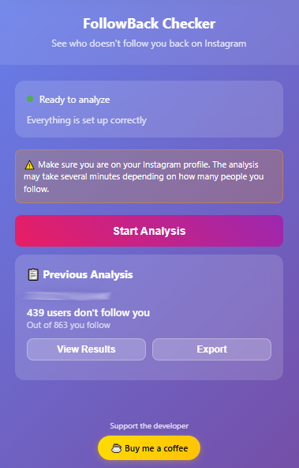
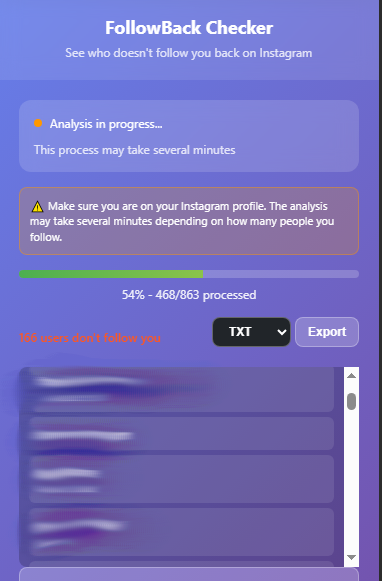

# FollowBack Checker – Instagram Unfollowers Extension

> Find out who doesn't follow you back on Instagram. No apps. No login. No passwords.

---

## What is it?

**FollowBack Checker** is an extension that helps you:
- Identify which users you follow that don't follow you back.
- Run the analysis directly from your Instagram profile.
- Export the list as a `.json` or `.txt` file — all from your browser.

---

## Features

- ✅ 100% local – your data stays on your device.
- 🔒 No passwords or credentials needed.
- ⚡ Runs directly on Instagram from your browser.
- 💾 Export results to `.json` or `.txt`.
- 🎯 Lightweight and easy to use.

---

## Installation

<details>
<summary><strong>🌐 Chrome / Chromium-based browsers (Edge, Opera, Brave, etc.)</strong></summary>

### Option 1: Download ZIP
1. [**Download the ZIP file**](https://github.com/ValBoschP/FollowBack-Checker/archive/refs/heads/main.zip) from GitHub.
2. Extract the ZIP file to a folder on your computer.
3. Open Chrome and go to `chrome://extensions` (or `edge://extensions` for Edge, `opera://extensions` for Opera, etc.).
4. Enable **Developer mode** in the top right corner.
5. Click on **Load unpacked** and select the `extension/` folder inside the extracted folder.
6. Go to [instagram.com](https://www.instagram.com), log in, and visit your profile.
7. Click on the extension icon in the toolbar and **run** the checker.

### Option 2: Clone the Repository with Git
1. Clone this repository:
   ```bash
   git clone https://github.com/ValBoschP/FollowBack-Checker.git
   ```
2. Open Chrome and go to `chrome://extensions` (or the equivalent for your Chromium-based browser).
3. Enable **Developer mode** in the top right corner.
4. Click on **Load unpacked** and select the `extension/` folder inside this repo.
5. Go to [instagram.com](https://www.instagram.com), log in, and visit your profile.
6. Click on the extension icon in the toolbar and **run** the checker.

</details>

<details>
<summary><strong>🦊 Firefox</strong></summary>

### Option 1: Download ZIP
1. [**Download the ZIP file**](https://github.com/ValBoschP/FollowBack-Checker/archive/refs/heads/main.zip) from GitHub.
2. Extract the ZIP file to a folder on your computer.
3. Open Firefox and go to `about:debugging`.
4. Click on **This Firefox** in the left sidebar.
5. Click on **Load Temporary Add-on**.
6. Navigate to the `extension/` folder and select the `manifest.json` file.
7. Go to [instagram.com](https://www.instagram.com), log in, and visit your profile.
8. Click on the extension icon in the toolbar and **run** the checker.

### Option 2: Clone the Repository with Git
1. Clone this repository:
   ```bash
   git clone https://github.com/ValBoschP/FollowBack-Checker.git
   ```
2. Open Firefox and go to `about:debugging`.
3. Click on **This Firefox** in the left sidebar.
4. Click on **Load Temporary Add-on**.
5. Navigate to the `extension/` folder inside the cloned repo and select the `manifest.json` file.
6. Go to [instagram.com](https://www.instagram.com), log in, and visit your profile.
7. Click on the extension icon in the toolbar and **run** the checker.

</details>

<details>
<summary><strong>🔷 Microsoft Edge</strong></summary>

### Option 1: Download ZIP
1. [**Download the ZIP file**](https://github.com/ValBoschP/FollowBack-Checker/archive/refs/heads/main.zip) from GitHub.
2. Extract the ZIP file to a folder on your computer.
3. Open Edge and go to `edge://extensions`.
4. Enable **Developer mode** in the left sidebar.
5. Click on **Load unpacked** and select the `extension/` folder inside the extracted folder.
6. Go to [instagram.com](https://www.instagram.com), log in, and visit your profile.
7. Click on the extension icon in the toolbar and **run** the checker.

### Option 2: Clone the Repository with Git
1. Clone this repository:
   ```bash
   git clone https://github.com/ValBoschP/FollowBack-Checker.git
   ```
2. Open Edge and go to `edge://extensions`.
3. Enable **Developer mode** in the left sidebar.
4. Click on **Load unpacked** and select the `extension/` folder inside this repo.
5. Go to [instagram.com](https://www.instagram.com), log in, and visit your profile.
6. Click on the extension icon in the toolbar and **run** the checker.

</details>


---

## 💿 Demo

Here’s how FollowBack Checker works in action:

### 1. Extension Launched with Last Analysis


### 2. Results, see who doesn’t follow you back  


---

## Privacy

FollowBack Checker processes everything **locally in your browser**.  
It does **not**:

- Request or access your Instagram password.
- Send any data to any external server.
- Track your browsing behavior.

🔐 [Read the full privacy policy »](./privacy-policy.md)

---

## 💜 Support

If you find this project useful, you can:

- ⭐ Star the repo on [GitHub](https://github.com/ValBoschP/FollowBack-Checker)
- ☕ [Buy me a coffee](https://www.buymeacoffee.com/ValBoschP) to support development
- 🐛 Open an issue if you encounter bugs or have suggestions

Every bit of support helps improve this project!

---

## License

This project is licensed under the [MIT License](./LICENSE).  
Copyright © [ValBoschP](https://github.com/ValBoschP)

---

## Contact

Got feedback or want to collaborate?

- 📬 GitHub: [@ValBoschP](https://github.com/ValBoschP)

---